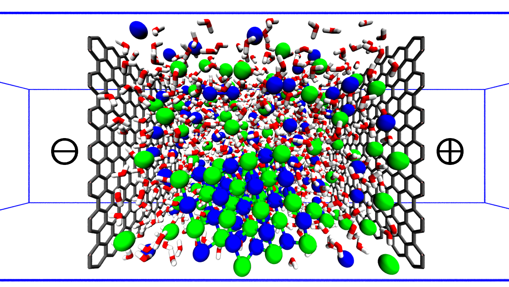

# NaCl_charged

The zip file contains essential files to run metadynamics simulations of NaCl nucleation from aqueous solutions near charged surfaces.

Software: GROMACS-2022.3, PLUMED-2.8.1

#### To read the paper, please visit:
Preprint: [https://doi.org/10.26434/chemrxiv-2024-00f19](https://doi.org/10.26434/chemrxiv-2024-00f19)

Publication: [https://doi.org/10.1021/jacs.4c16419](https://doi.org/10.1021/jacs.4c16419)
